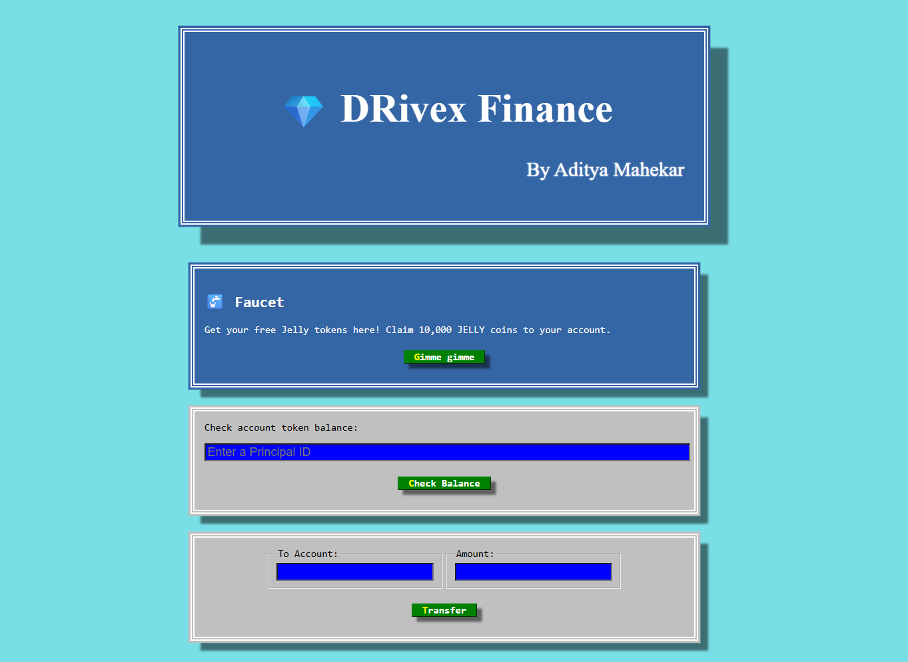
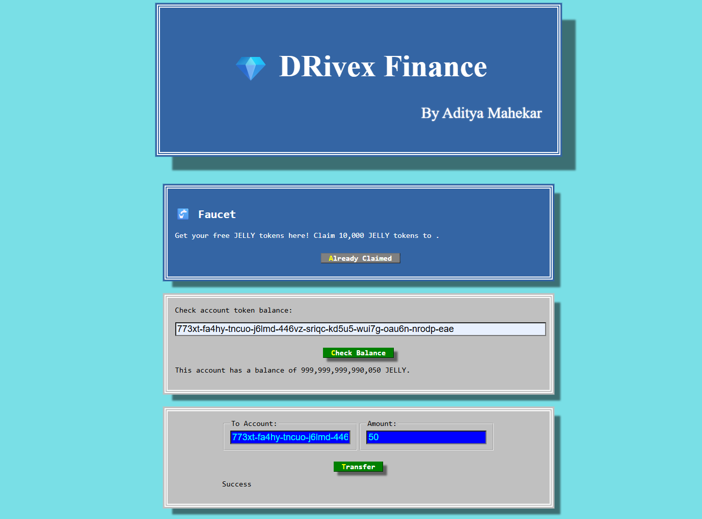
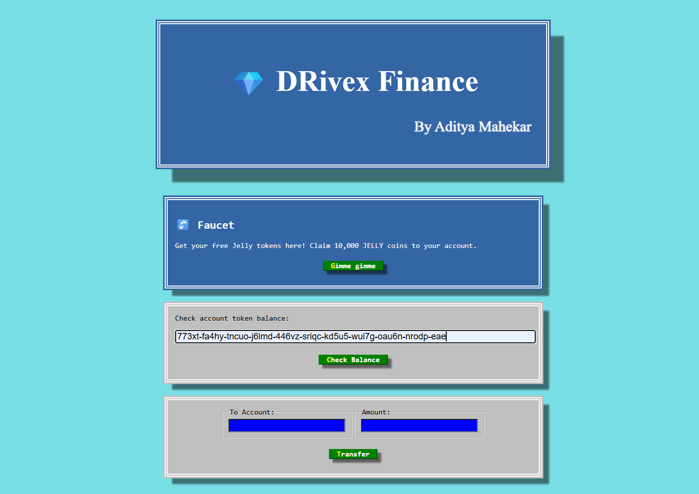
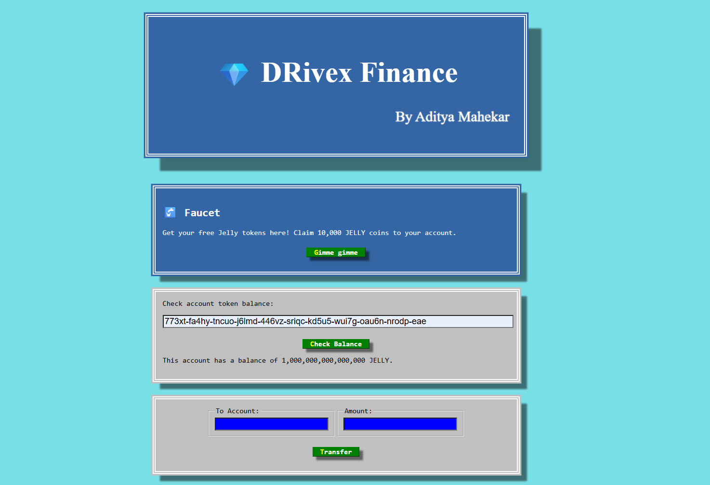
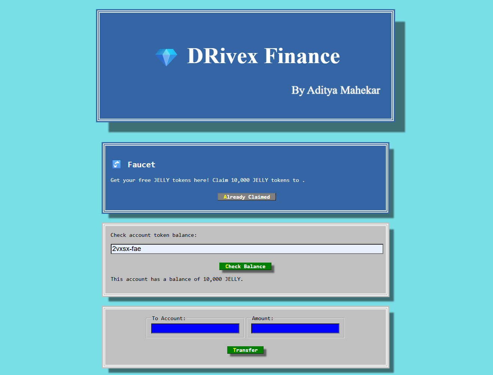
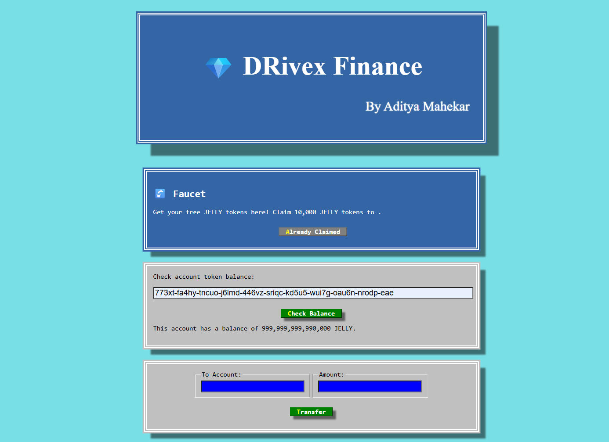
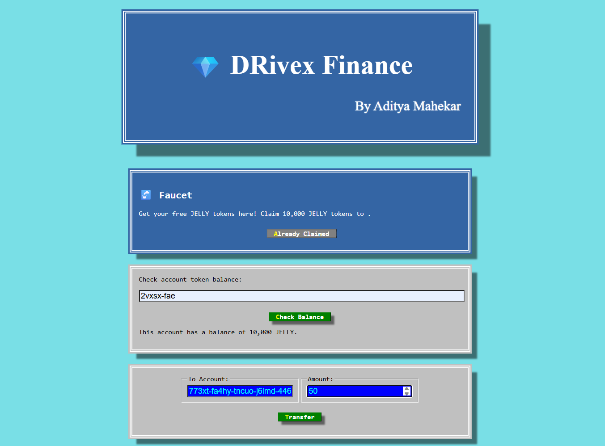
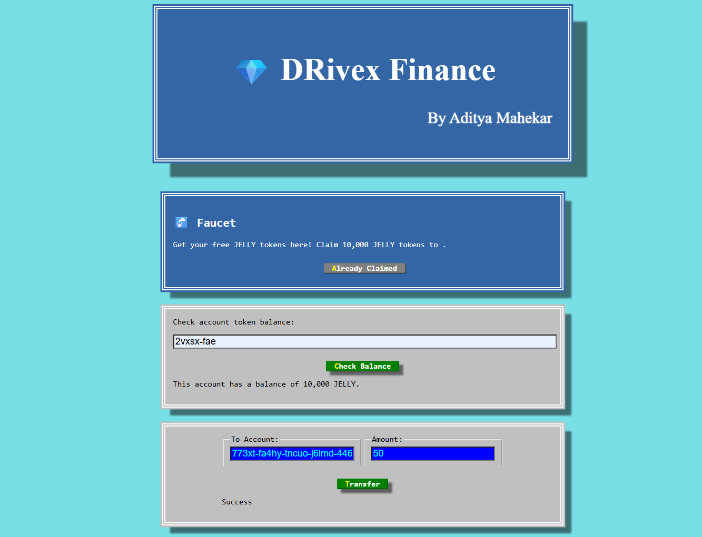
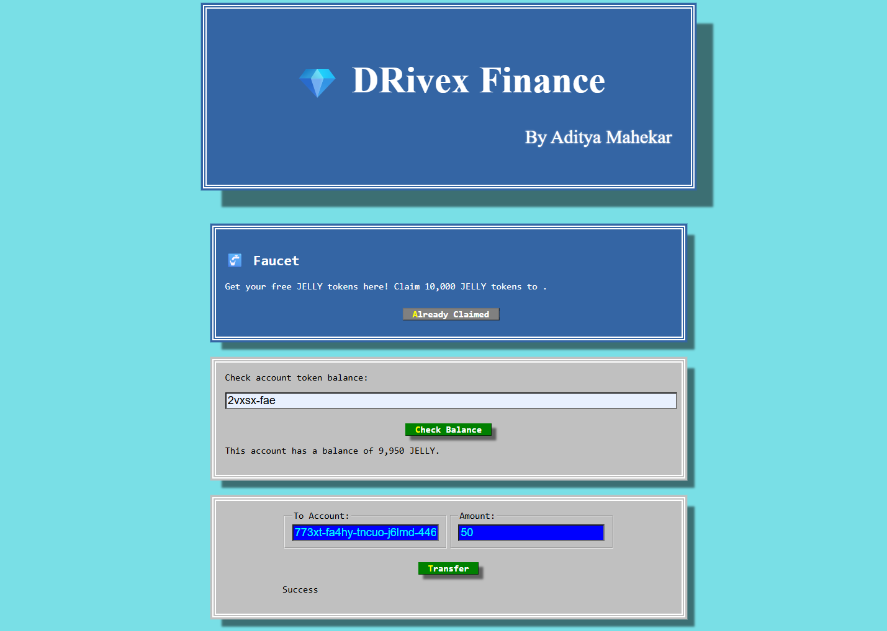
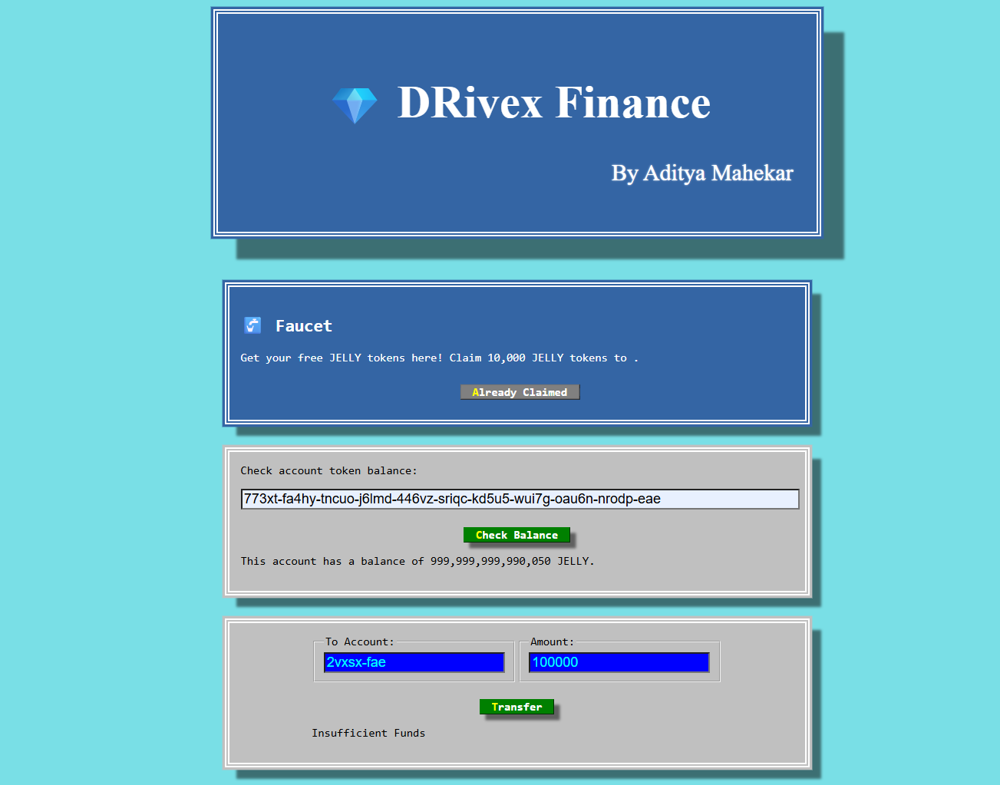

# 💎 DRivex Finance  
**By Aditya Mahekar**

A decentralized token project built on the Internet Computer (ICP) network.  
It provides a faucet, balance checker, and transfer system for the **JELLY Token**.

---

## 🧠 Features

- **Faucet System** – Claim 10,000 free JELLY tokens instantly.  
- **Check Balance** – View account balances using Principal IDs.  
- **Transfer Tokens** – Send JELLY tokens to other accounts securely.  
- **ICP Integration** – Fully deployed and operational on the Internet Computer network.  
- **Frontend + Backend Setup** – React for UI, Motoko for backend logic.  
- **Real-Time Interaction** – Immediate response for transactions and balance updates.  
- **Secure Principal Identity** – Uses DFX identities for authentication and ownership.  

---

## 🖥️ Languages & Technologies Used

| Technology | Purpose |
|:------------|:---------|
| **HTML** | Page structure |
| **CSS** | Styling and design |
| **JavaScript (JS)** | Frontend interactivity |
| **React.js** | UI framework |
| **Motoko** | Backend smart contract language |
| **DFX SDK** | Internet Computer deployment tool |

---
## 📚 Resources

- [Quick Start](https://sdk.dfinity.org/docs/quickstart/quickstart-intro.html)
- [SDK Developer Tools](https://sdk.dfinity.org/docs/developers-guide/sdk-guide.html)
- [Motoko Programming Language Guide](https://sdk.dfinity.org/docs/language-guide/motoko.html)
- [Motoko Language Quick Reference](https://sdk.dfinity.org/docs/language-guide/language-manual.html)
- [JavaScript API Reference](https://erxue-5aaaa-aaaab-qaagq-cai.raw.ic0.app)
  
---
## 🖼️ Project Preview

| UI | Claim 10000 Tokens |
|:--:|:--:|
|  |  |

| Paste Profile 1 ID | Check Balance of Profile 1 |
|:--:|:--:|
|  |  |

| Profile 2 Balance | Profile 1 Balance Credited |
|:--:|:--:|
|  |  |

| Profile 2 to Balance Transfer | Profile 2 Transfer 50 Tokens Successfully |
|:--:|:--:|
|  |  |

| Profile 2 Balance Debit | Profile 2 Insufficient Fund |
|:--:|:--:|
|  |  |


---
# ⚙️ Setup and Local Deployment


1. Install dependencies
```bash
npm i
```
3. Start the local ICP replica
```bash
dfx start --clean
```
5. Deploy your canisters (backend + frontend)
```bash
dfx deploy
```
6. Start the frontend locally
```bash
npm start
```

Once the project starts, open it in your browser at:
👉 http://localhost:1080

---
# 💰 Check Your Balance

1. Find out your principal ID:
   ```bash
   dfx identity get-principal
   ```

2. Save it somewhere safe (e.g. 773xt-fa4hy-tncuo-j6lmd-446vz-sriqc-kd5u5-wui7g-oau6n-nrodp-eae)

3. Format and store it in a variable:
   ```bash
   OWNER_PUBLIC_KEY="principal \"$( \dfx identity get-principal )\""
   ```

4. Verify it:
   ```bash
   echo $OWNER_PUBLIC_KEY
   ```

5. Check your balance:
   ```bash
   dfx canister call token balanceOf "( $OWNER_PUBLIC_KEY )"
   ```

---

# ⚡ Charge the Canister

1. Get the canister ID:
   ```bash
   dfx canister id token
   ```

2. Save it in a variable:
   ```bash
   CANISTER_PUBLIC_KEY="principal \"$( \dfx canister id token )\""
   ```

3. Confirm:
   ```bash
   echo $CANISTER_PUBLIC_KEY
   ```

4. Transfer 500M tokens to the canister:
   ```bash
   dfx canister call token transfer "($CANISTER_PUBLIC_KEY, 500_000_000)"
   ```

---

# 🌐 Deploy to Live IC Network

1. Deploy canisters:
   ```bash
   dfx deploy --network ic
   ```

2. Get live canister ID:
   ```bash
   dfx canister --network ic id token
   ```

3. Save it:
   ```bash
   LIVE_CANISTER_KEY="principal \"$( \dfx canister --network ic id token )\""
   ```

4. Verify:
   ```bash
   echo $LIVE_CANISTER_KEY
   ```

5. Transfer 50M tokens to live canister:
   ```bash
   dfx canister --network ic call token transfer "($LIVE_CANISTER_KEY, 50_000_000)"
   ```

6. Get front-end canister ID:
   ```bash
   dfx canister --network ic id token_assets
   ```

7. Add `.raw.ic0.app` to access your live app (example):
   ```
   https://zdv65-7qaaa-aaaai-qibdq-cai.raw.ic0.app
   ```
